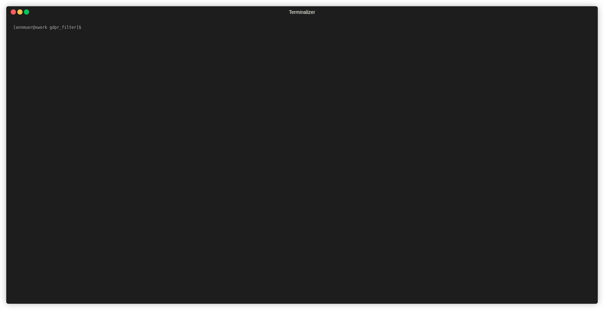

# NGINX module "GDPR" PoC

This PoC shows how to filter output content in order to "prevent" leaks from flawed sources.

# How it works
This module sets **output** filter and changes all emails (xxxx@yyy.com) to \*\*\*\*@\*\*\*.\*\*\*

In production, we could filter our secrets/clients names/etc to remove them automatically.


# How to run

```bash
# build the image
podman build -t gdpr_filter -f build/Dockerfile .
# run the image
podman run -ti -p 8080:8080,8081:8081 localhost/gdpr_filter:latest
# unfiltered
curl 127.0.0.1:8080
# filtered
curl 127.0.0.1:8081
```

# How to play with the code
In the [lib.rs](src/lib.rs) you may find the body filter:

```rust
unsafe extern "C" fn ngx_http_gdpr_body_filter(
    r: *mut ngx_http_request_t,
    chain: *mut ngx_chain_t,
) -> ngx_int_t {
    // ...
}

```

Start there and see what happens.